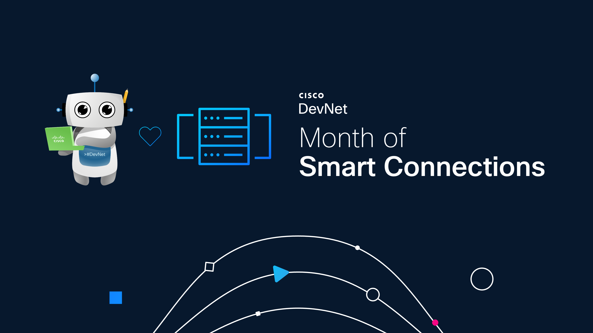

<h1 align="center">Month of Smart Connections 🔗🤝💫</h1>

 

    
    
    
    
    

---

Welcome to **Month of Smart Connections**! Every Thursday this February, we’re releasing bite-sized network automation code samples and demos to help you connect, automate, and innovate, no matter the vendor.

Think of this as your **weekly dose of network love and friendship**, delivered with real-world code you can run and learn from. 🚀

---

## 📅 Schedule

Each week of February, a new folder with working examples will be published:

| Week | Release Date | Folder | Episode in YouTube |
|------|--------------|--------|-------------|
| Week 1 | Thursday, Feb 5 | `week-01-automation-multivendor` 🔗 | [🎞️ Click to view!](https://www.youtube.com/watch?v=5OG3_zJ25KE) |
| Week 2 | Thursday, Feb 12 | `week-02-automation-patterns` ⚙️ | [🎞️ Click to view!](https://www.youtube.com/watch?v=EqcBJdX24p8) |
| Week 3 | Thursday, Feb 19 | `week-03-automation-testing` ✅ | [🎞️ Click to view!](https://youtu.be/AAb5Pw1gFto) |
| Week 4 | Thursday, Feb 26 | `week-04-agentic-automation` 🤖 | `Not released yet!` |

---

## 📂 Code Samples Overview

| Folder | Sample Name | Description | 
|--------|------------|-------------|
| [week-01-automation-multivendor](/week-01-automation-multivendor/) 🔗 | **Loving All Vendors** | Push and pull interface configurations to/from multivendor networks using Cisco NSO. One RESTCONF API, zero vendor drama. 🔗🤝🤖 |
| [`week-02-automation-patterns`](/week-02-automation-patterns/) ⚙️ | **Choose Your Love Language** | Demonstrate the same multivendor network task using Python, Ansible, and CI/CD pipelines. All vendors in - with OpenConfig and gNMI in all the tools. Pick your style! 🐍📦🔄 |
| [`week-03-automation-testing`](/week-03-automation-testing/) ✅ | **Trust Issues** | Run audits in your multivendor network with Robot Framework. Safety first! ✅🛡️ |
| [`week-04-agentic-automation`](/week-04-agentic-automation/) 🤖 | **Intentions Matter** | Prototype agentic automation with AI/intent-driven agents for network tasks. 💡🤖⚡ |

---

## 🚀 How to Use This Repo

1. Pick a week/folder you’re interested in.  
2. Follow the README inside for setup instructions and code examples.  
3. Run, experiment, and adapt to your own network labs.  
4. Share your results or feedback—we love seeing networks connect! 🌟

---

Let’s celebrate **network connectivity, automation, and a pinch of love for your devices**. Happy automating! 🔗🤝💫