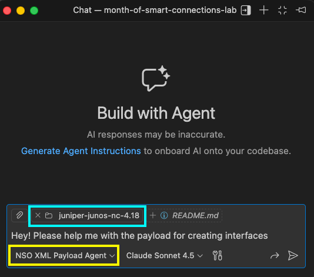
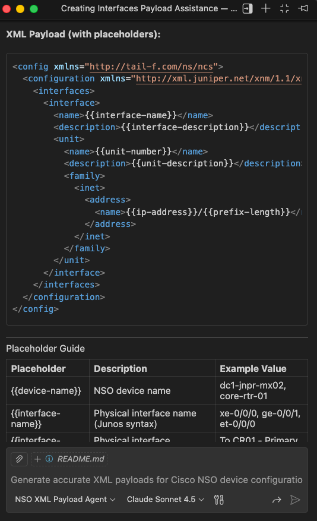
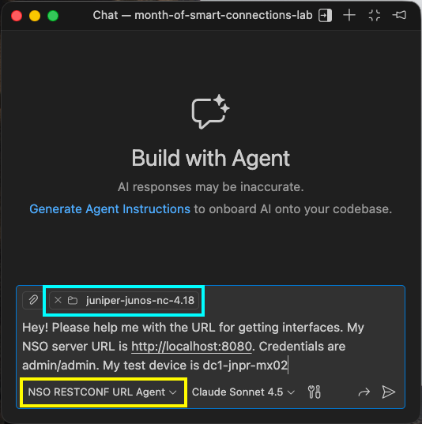
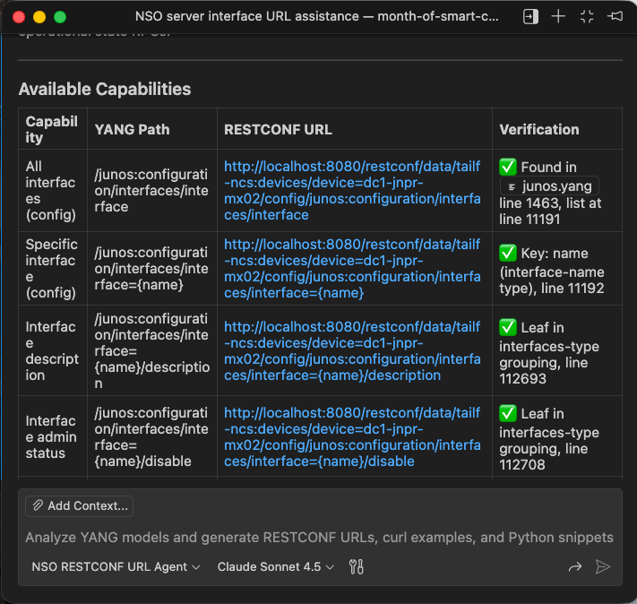
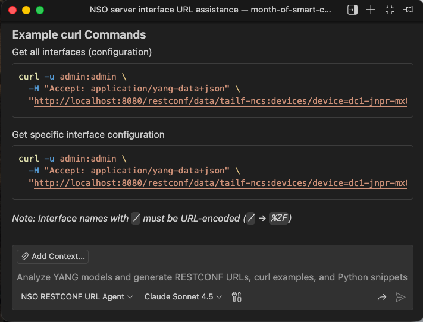
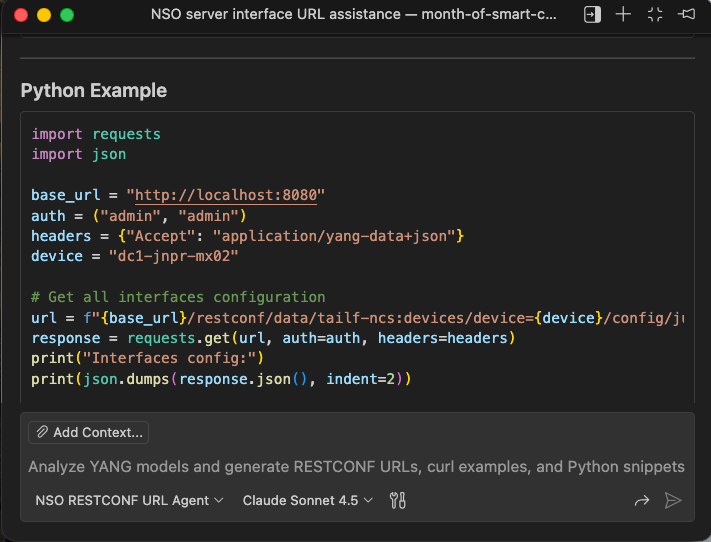

# Week 1: Loving All Vendors

**Part of the [Month of Smart Connections Lab](https://github.com/ponchotitlan/month-of-smart-connections-lab)**

A pair of Python tools for interacting with Cisco NSO via RESTCONF API. Query multi-vendor network devices and push XML configurations programmatically. Because when it comes to network automation, NSO plays well with everyone.

## Meet Cisco NSO: Vendor-Neutral, Emotionally Available

Cisco NSO (Network Services Orchestrator) is a network automation and orchestration platform designed to bring order to the chaos of multi-vendor, multi-technology environments. Instead of forcing you to manage each device family with its own tools and quirks, NSO acts like a universal translator and conductor, letting you define services once and have them consistently deployed across routers, switches, firewalls, and controllers from almost any vendor.

Think of NSO less as “yet another management tool” and more as the calm, polyglot diplomat in a room full of strong personalities, comfortable speaking Juniper, Cisco, Nokia, Arista, and more without taking sides.

**What NSO can do for heterogeneous networks:**

- ⚙️ `Model-driven automation across vendors:` Use YANG models and service templates to define intent once and apply it consistently across different platforms, reducing human error and configuration drift.

- 🔁 `Lifecycle management for network services:` Handle provisioning, updates, rollbacks, and compliance checks end-to-end, so changes stay predictable even when the underlying devices are wildly different.

- 📈 `Scales with complexity, not against it`: As your network grows more diverse, NSO becomes more valuable—like the one system that actually enjoys the diversity instead of breaking under it.

Here are some resources that you can explore yourself:

| Resource Type | Name / Description |
|--------------|----------------------|
| [📘 Documentation Home](https://developer.cisco.com/docs/nso/) | Official NSO docs (product guides, API references, examples) – your go-to reference for everything NSO. |
| [🎓 DevNet NSO Site](https://developer.cisco.com/site/nso/) | Central NSO DevNet landing page with tutorials, learning labs, examples, community links & more. |
| [🧪 NSO Sandbox](https://developer.cisco.com/sandbox/) | Cisco DevNet Sandbox environments where you can interact with NSO without installing anything locally (search for “NSO”). |
| [🛠 NSO Examples (GitHub)](https://github.com/NSO-developer) | Sample code, service packages, and automation examples for NSO. Great for learning by doing. |
| [☁️ NSO Playground / Code Exchange](https://developer.cisco.com/codeexchange/search/?products=NSO) | Community examples and experiments related to NSO, available via Cisco Code Exchange. |
| [💬 NSO Developer Community](https://community.cisco.com/t5/nso-developer-hub/ct-p/5672j-dev-nso) | Forums and discussions with other NSO engineers and Cisco experts. |

## What's Included in this repository

To use the following scripts, simply git clone this repository and use pip to install the dependencies required:

```bash
git clone https://github.com/ponchotitlan/month-of-smart-connections-lab.git
```

```bash
cd week-01-nso-multivendor && pip install -r requirements.txt
```

### 1. Multi-Vendor XML Configuration Pusher
**📁 File:** [nso_restconf_config_pusher.py](https://github.com/ponchotitlan/month-of-smart-connections-lab/blob/main/week-01-nso-multivendor/nso_restconf_config_pusher.py)

Push XML configuration payloads to NSO devices via RESTCONF. Supports batch processing of multiple configurations with detailed success/failure reporting.

**What it does:**
- Loads XML configuration files from disk
- Pushes configs to specific devices via PATCH requests
- Auto-detects device names from XML (or use CLI override)
- Provides detailed response analysis and timing
- Processes multiple files in sequence

**Usage:**
```bash
# Single file with auto-detected device name
python3 nso_restconf_config_pusher.py config.xml

# Override device name
python3 nso_restconf_config_pusher.py config.xml -d router-01

# Multiple files
python3 nso_restconf_config_pusher.py config1.xml config2.xml config3.xml

# Custom NSO instance
python3 nso_restconf_config_pusher.py config.xml \
    -n http://nso.example.com:8080 \
    -u admin \
    -p admin123

# Verbose mode with XML preview
python3 nso_restconf_config_pusher.py config.xml -v
```

```
% python nso_restconf_config_pusher.py -d dc1-jnpr-mx02 juniper_junos_interfaces.xml -v

============================================================
🔧 NSO RESTCONF Configuration Pusher
============================================================


🔷🔷🔷🔷🔷🔷🔷🔷🔷🔷🔷🔷🔷🔷🔷🔷🔷🔷🔷🔷🔷🔷🔷🔷🔷🔷🔷🔷🔷🔷
📦 Processing file 1/1: juniper_junos_interfaces.xml
🔷🔷🔷🔷🔷🔷🔷🔷🔷🔷🔷🔷🔷🔷🔷🔷🔷🔷🔷🔷🔷🔷🔷🔷🔷🔷🔷🔷🔷🔷

📂 Loading XML file: juniper_junos_interfaces.xml
📏 File size: 1930 characters
✅ File loaded successfully

📝 XML Preview (first 500 chars):
------------------------------------------------------------
<config xmlns="http://tail-f.com/ns/ncs">
  <configuration xmlns="http://xml.juniper.net/xnm/1.1/xnm">
    <interfaces>
      <interface>
        <name>xe-0/0/4</name>
        <description>To CR01 (xe-2/1/0) - Primary DC uplink</description>
        <unit>
          <name>0</name>
          <description>L3 transit to Core Router CR01</description>
          <family>
            <inet>
              <address>
                <name>10.10.1.4/24</name>
              </address>
            </inet>
 
...
------------------------------------------------------------

🚀 Pushing configuration to device: dc1-jnpr-mx02
🔗 URL: http://localhost:8080/restconf/data/tailf-ncs:devices/device=dc1-jnpr-mx02/config
📡 Sending PATCH request...

============================================================
✅ SUCCESS! Configuration applied successfully
============================================================
📱 Device: dc1-jnpr-mx02
📊 Status Code: 204
⏰ Response Time: 0.03s

🎉 Configuration is now active on the device!

============================================================
📊 FINAL SUMMARY
============================================================
📁 Total files processed: 1
✅ Successful: 1
❌ Failed: 0

🎊 All configurations applied successfully!
============================================================
```

**An Agent at your service:**

**✅ Need to generate XML payloads?** Use the [NSO XML Payload Generator Agent](https://github.com/ponchotitlan/month-of-smart-connections-lab/blob/main/.github/agents/nso_xml_payload_gen_agent.md) to create vendor-specific configuration payloads based on NSO YANG models.

If you are using [GitHub Copilot](https://github.com/features/copilot), you will see the `NSO RESTCONF URL Agent` available in your agents pick-list.

Simply drag the folder of your NED and ask it to provide the structure of the configuration that you need. Optionally, you can add the details of your NSO server and even test device so the agent generates pre-populated payloads.

<div align="center">
</br>

</div>


### 2. Multi-Vendor Interface Query Tool
**📁 File:** [nso_restconf_multivendor_queries.py](https://github.com/ponchotitlan/month-of-smart-connections-lab/blob/main/week-01-nso-multivendor/nso_restconf_multivendor_queries.py)

Query network devices managed by NSO and display their interface information in clean ASCII tables. Supports Cisco (ASA, IOS-XR), Juniper (Junos), and Fortinet (FortiOS) platforms - but go ahead and add your own devices and parsers!

**What it does:**
- Tests RESTCONF connectivity to NSO
- Discovers all managed devices automatically
- Identifies device platforms via CLI or NETCONF
- Retrieves interface configurations per vendor
- Displays results in formatted tables with vendor-specific icons

**Usage:**
```bash
# Basic usage with defaults (localhost:8080, admin/admin)
python3 nso_restconf_multivendor_queries.py

# Custom NSO instance
python3 nso_restconf_multivendor_queries.py \
    --url nso.example.com \
    --port 443 \
    --username admin \
    --password secret

# Verbose output
python3 nso_restconf_multivendor_queries.py --verbose
```

```
% python nso_restconf_multivendor_queries.py 

╔═══════════════════════════════════════════════════════════════════════════╗
║                                                                           ║
║        🌐  Cisco NSO RESTCONF Multi-Vendor Interface Query Tool  🌐       ║
║                                                                           ║
╚═══════════════════════════════════════════════════════════════════════════╝
    
🔗 Connecting to NSO at http://localhost:8080
👤 Username: admin

================================================================================
  🔌 CONNECTIVITY TEST
================================================================================
✅ RESTCONF connectivity successful

================================================================================
  📡 RETRIEVING DEVICES
================================================================================
📋 Found 4 device(s)

🔍 Processing device: asa-fw-01
   ✓ Platform detected: cisco-asa-cli-6.18:cisco-asa-cli-6.18 (via cli)
   ✓ Retrieved 1 interface(s)

🔍 Processing device: asr9k-xr-7601
   ✓ Platform detected: cisco-iosxr-cli-7.69:cisco-iosxr-cli-7.69 (via cli)
   ✓ Retrieved 1 interface(s)

🔍 Processing device: dc1-fgt-fw01
   ✓ Platform detected: fortinet-fortios-cli-5.11:fortinet-fortios-cli-5.11 (via cli)
   ✓ Retrieved 9 interface(s)

🔍 Processing device: dc1-jnpr-mx02
   ✓ Platform detected: juniper-junos-nc-4.18:juniper-junos-nc-4.18 (via netconf)
   ✓ Retrieved 9 interface(s)


================================================================================
  📊 DEVICE SUMMARY
================================================================================
╒═════════════════╤═════════════════════════════════════════════════════╤══════════════╤═══════════╕
│ Device          │ Platform                                            │   Interfaces │ Status    │
╞═════════════════╪═════════════════════════════════════════════════════╪══════════════╪═══════════╡
│ 🔷 asa-fw-01     │ cisco-asa-cli-6.18:cisco-asa-cli-6.18               │            1 │ ✅ Success │
├─────────────────┼─────────────────────────────────────────────────────┼──────────────┼───────────┤
│ 🔷 asr9k-xr-7601 │ cisco-iosxr-cli-7.69:cisco-iosxr-cli-7.69           │            1 │ ✅ Success │
├─────────────────┼─────────────────────────────────────────────────────┼──────────────┼───────────┤
│ 🔴 dc1-fgt-fw01  │ fortinet-fortios-cli-5.11:fortinet-fortios-cli-5.11 │            9 │ ✅ Success │
├─────────────────┼─────────────────────────────────────────────────────┼──────────────┼───────────┤
│ 🟢 dc1-jnpr-mx02 │ juniper-junos-nc-4.18:juniper-junos-nc-4.18         │            9 │ ✅ Success │
╘═════════════════╧═════════════════════════════════════════════════════╧══════════════╧═══════════╛

================================================================================
  🔍 DETAILED INTERFACE INFORMATION
================================================================================

================================================================================
  🔷 asa-fw-01 - cisco-asa-cli-6.18:cisco-asa-cli-6.18
================================================================================
╒═════╤══════════════════╤══════════╤══════════════╤════════════╤═════════════════╕
│   # │ Interface Name   │ Type     │ IP Address   │ Status     │ Description     │
╞═════╪══════════════════╪══════════╪══════════════╪════════════╪═════════════════╡
│   1 │ Ethernet0/0      │ Ethernet │ 10.25.26.8   │ Configured │ TestDescription │
╘═════╧══════════════════╧══════════╧══════════════╧════════════╧═════════════════╛

💡 Total interfaces: 1


================================================================================
  🔷 asr9k-xr-7601 - cisco-iosxr-cli-7.69:cisco-iosxr-cli-7.69
================================================================================
╒═════╤═════════════════════╤═════════════════╤═══════════════════════════╤════════════╤═══════════════╕
│   # │ Interface Name      │ Type            │ IP Address                │ Status     │ Description   │
╞═════╪═════════════════════╪═════════════════╪═══════════════════════════╪════════════╪═══════════════╡
│   1 │ GigabitEthernet0/10 │ GigabitEthernet │ 192.168.1.1 255.255.255.0 │ Configured │ TestDemo      │
╘═════╧═════════════════════╧═════════════════╧═══════════════════════════╧════════════╧═══════════════╛

💡 Total interfaces: 1


================================================================================
  🔴 dc1-fgt-fw01 - fortinet-fortios-cli-5.11:fortinet-fortios-cli-5.11
================================================================================
╒═════╤══════════════════╤════════════╤═══════════════════════════╤══════════╤═══════════════════════════════════════╕
│   # │ Interface Name   │ Type       │ IP Address                │ Status   │ Description                           │
╞═════╪══════════════════╪════════════╪═══════════════════════════╪══════════╪═══════════════════════════════════════╡
│   1 │ mesh.root        │ vap-switch │ -                         │ unknown  │ VDOM: root                            │
├─────┼──────────────────┼────────────┼───────────────────────────┼──────────┼───────────────────────────────────────┤
│   2 │ port1            │ physical   │ 192.168.1.1 255.255.255.0 │ up       │ Access: https, ping, ssh | VDOM: root │
├─────┼──────────────────┼────────────┼───────────────────────────┼──────────┼───────────────────────────────────────┤
│   3 │ port2            │ physical   │ 192.168.1.2 255.255.255.0 │ up       │ Access: https, ping, ssh | VDOM: root │
├─────┼──────────────────┼────────────┼───────────────────────────┼──────────┼───────────────────────────────────────┤
│   4 │ port3            │ physical   │ 192.168.1.3 255.255.255.0 │ up       │ Access: https, ping, ssh | VDOM: root │
├─────┼──────────────────┼────────────┼───────────────────────────┼──────────┼───────────────────────────────────────┤
│   5 │ port4            │ physical   │ 192.168.1.4 255.255.255.0 │ up       │ Access: https, ping, ssh | VDOM: root │
├─────┼──────────────────┼────────────┼───────────────────────────┼──────────┼───────────────────────────────────────┤
│   6 │ port5            │ physical   │ 192.168.1.5 255.255.255.0 │ up       │ Access: https, ping, ssh | VDOM: root │
├─────┼──────────────────┼────────────┼───────────────────────────┼──────────┼───────────────────────────────────────┤
│   7 │ port6            │ physical   │ 192.168.1.6 255.255.255.0 │ up       │ Access: https, ping, ssh | VDOM: root │
├─────┼──────────────────┼────────────┼───────────────────────────┼──────────┼───────────────────────────────────────┤
│   8 │ port7            │ physical   │ 192.168.1.7 255.255.255.0 │ up       │ Access: https, ping, ssh | VDOM: root │
├─────┼──────────────────┼────────────┼───────────────────────────┼──────────┼───────────────────────────────────────┤
│   9 │ port9            │ N/A        │ -                         │ unknown  │ VDOM: root                            │
╘═════╧══════════════════╧════════════╧═══════════════════════════╧══════════╧═══════════════════════════════════════╛

💡 Total interfaces: 9


================================================================================
  🟢 dc1-jnpr-mx02 - juniper-junos-nc-4.18:juniper-junos-nc-4.18
================================================================================
╒═════╤══════════════════╤══════════╤════════════════╤════════════╤══════════════════════════════════════════╕
│   # │ Interface Name   │ Type     │ IP Address     │ Status     │ Description                              │
╞═════╪══════════════════╪══════════╪════════════════╪════════════╪══════════════════════════════════════════╡
│   1 │ lo0              │ Physical │ 192.168.1.1/32 │ Configured │                                          │
├─────┼──────────────────┼──────────┼────────────────┼────────────┼──────────────────────────────────────────┤
│   2 │ xe-0/0/0         │ Physical │ 10.10.1.1/24   │ Configured │                                          │
├─────┼──────────────────┼──────────┼────────────────┼────────────┼──────────────────────────────────────────┤
│   3 │ xe-0/0/1         │ Physical │ 10.10.2.1/24   │ Configured │                                          │
├─────┼──────────────────┼──────────┼────────────────┼────────────┼──────────────────────────────────────────┤
│   4 │ xe-0/0/2         │ Physical │ 10.10.8.6/24   │ Configured │                                          │
├─────┼──────────────────┼──────────┼────────────────┼────────────┼──────────────────────────────────────────┤
│   5 │ xe-0/0/3         │ Physical │ 10.10.1.1/24   │ Configured │ Uplink to Core Router                    │
├─────┼──────────────────┼──────────┼────────────────┼────────────┼──────────────────────────────────────────┤
│   6 │ xe-0/0/4         │ Physical │ 10.10.1.4/24   │ Configured │ To CR01 (xe-2/1/0) - Primary DC uplink   │
├─────┼──────────────────┼──────────┼────────────────┼────────────┼──────────────────────────────────────────┤
│   7 │ xe-0/0/5         │ Physical │ 10.10.1.5/24   │ Configured │ To CR02 (xe-2/1/0) - Secondary DC uplink │
├─────┼──────────────────┼──────────┼────────────────┼────────────┼──────────────────────────────────────────┤
│   8 │ xe-0/0/6         │ Physical │ 10.10.1.6/24   │ Configured │ To FW01 (xe-0/0/3) - Northbound firewall │
├─────┼──────────────────┼──────────┼────────────────┼────────────┼──────────────────────────────────────────┤
│   9 │ xe-0/0/7         │ Physical │ 10.10.1.7/24   │ Configured │ To DIST01 (xe-1/0/24) - Aggregation l... │
╘═════╧══════════════════╧══════════╧════════════════╧════════════╧══════════════════════════════════════════╛

💡 Total interfaces: 9


================================================================================
  ✨ QUERY COMPLETE
================================================================================

    📊 Summary Statistics:
       • Total Devices Queried: 4
       • Successful Queries: 4
       • Total Interfaces Found: 20
    
    🎉 Query completed successfully!
```

**An Agent at your service:**

**✅ Need help building RESTCONF URLs?** Use the [NSO RESTCONF URL Generator Agent](https://github.com/ponchotitlan/month-of-smart-connections-lab/blob/main/.github/agents/nso_restconf_url_agent.md) to construct vendor-specific API paths.

If you are using [GitHub Copilot](https://github.com/features/copilot), you will see the `NSO RESTCONF URL Agent` available in your agents pick-list.

Simply drag the folder of your NED and ask it to provide the URL to get the configuration that you need. Optionally, you can add the details of your NSO server and even test device so the agent generates pre-populated cURL requests and python snippets that you can test right away.

<div align="center">
</br>
</br>
</br>

</div>

## 🧪 Lab Options (No Excuses Edition)

You don’t need a fancy home lab to get started with this repo — NSO is generous with its love.

### Option 1: Use Cisco’s Always-On Sandbox (fastest way)
If you don’t have an NSO environment, you can use the **free always-on Cisco DevNet sandbox**:
👉 https://developer.cisco.com/sandbox/

Just search for **“NSO”** in the catalog and you’ll get a ready-made environment to run these scripts against.

### Option 2: Build Your Own Containerized NSO Lab (more advanced, more fun)
If you want something closer to a real engineering setup, Cisco provides an excellent container-based environment here:
👉 https://github.com/NSO-developer/nso-consistent-dev-environment

This lets you spin up a reproducible, local NSO lab using Docker — ideal if you want to experiment, extend, or break things safely.

### Out-of-the-box supported vendors (NEDs in this lab)
This project assumes the following NEDs are available in your environment:

- `cisco-asa-cli-6.18`  
- `cisco-iosxr-cli-7.69`  
- `fortinet-fortios-cli-5.11`  
- `juniper-junos-nc-4.18`  

If your lab uses different NED versions, you may need to adjust paths or payloads.

---

**⬅️ Previous Week:** N/A (Week 1)  
**➡️ Next Week:** [Week 2 - Service Orchestration]()  
**📚 Main Repository:** [Month of Smart Connections Lab](https://github.com/ponchotitlan/month-of-smart-connections-lab)