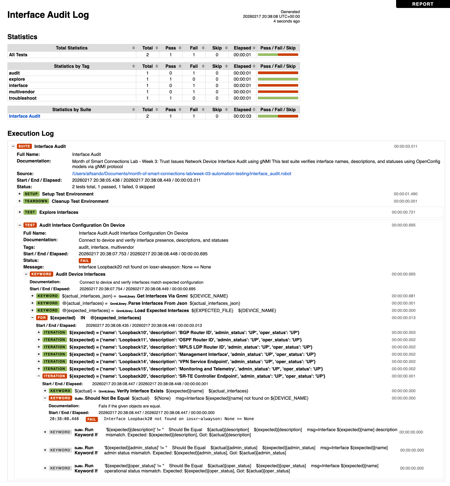

# Week 3: Trust Issues

**Part of the [Month of Smart Connections Lab](https://github.com/ponchotitlan/month-of-smart-connections-lab)**

Network automation testing using Robot Framework, gNMI, and OpenConfig. Automated configuration audits to verify that your network devices match expected standards.

## Why Test Automation for Config Audits?

Deploying configurations is only half the story. How do you know the changes actually worked? Or that someone didn't manually modify a critical interface description? Test automation provides:

- **Continuous Validation:** Automatically verify configurations match expected standards
- **Drift Detection:** Catch unauthorized changes before they cause outages
- **Compliance Verification:** Ensure devices meet organizational policies
- **Audit Trails:** Document configuration state over time with pass/fail reports

This project uses **Robot Framework** to audit network interface configurations via gNMI and OpenConfig, comparing actual device state against expected baseline configurations.

## Robot Framework

[Robot Framework](https://robotframework.org/) is an open-source test automation framework with keyword-driven syntax. It's ideal for network testing because:

- Tests are written in plain English (readable by non-programmers)
- Extensible with custom Python libraries (like our gNMI library)
- Generates detailed HTML reports automatically
- Integrates easily with CI/CD pipelines

## Test Suite Overview

| Component | Description |
|-----------|-------------|
| **File** | `interface_audit.robot` |
| **Test Cases** | `Explore Interfaces` - displays all interfaces<br>`Audit Interface Configuration` - validates against expected config |
| **Variables** | Device connection parameters (name, host, port, credentials) |
| **Setup/Teardown** | Connects to device at start, disconnects at end |
| **Expected Config** | Loaded from `expected_interfaces.json` |
| **Validation** | Checks interface existence, descriptions, admin/oper status |

## Custom Keywords (GnmiLibrary.py)

| Keyword | Purpose |
|---------|---------|
| `Connect To Device Inline` | Establish gNMI connection to network device |
| `Get Interfaces Via GNMI` | Retrieve interface configurations using OpenConfig |
| `Parse Interfaces From JSON` | Extract interface details from gNMI response |
| `Load Expected Interfaces` | Load expected configurations from JSON file |
| `Verify Interface Exists` | Check if interface exists in actual data |
| `Disconnect From Device` | Close gNMI connection |

## Setup

Create a virtual environment and install dependencies:

```bash
# Navigate to directory
cd week-03-automation-testing

# Create virtual environment
python3 -m venv venv

# Activate virtual environment
source venv/bin/activate  # On macOS/Linux
# or
venv\Scripts\activate  # On Windows

# Install dependencies
pip install -r requirements.txt
```

**Dependencies (requirements.txt):**
- `robotframework>=6.0` - Test automation framework
- `pygnmi>=0.8.13` - gNMI client library
- `pyyaml>=6.0` - YAML parsing

## Running the Tests

**Basic execution with default parameters:**

```bash
robot interface_audit.robot
```

**Override device parameters:**

```bash
robot \
  --variable DEVICE_NAME:iosxr-alwayson \
  --variable DEVICE_HOST:sandbox-iosxr-1.cisco.com \
  --variable DEVICE_PORT:57777 \
  --variable DEVICE_USERNAME:admin \
  --variable DEVICE_PASSWORD:C1sco12345 \
  interface_audit.robot
```

> **Don't have an environment of your own?** Use the [Always-On Sandbox Lab](devnetsandbox.cisco.com) - Look for `IOS XR Always-on`, book and test. Everything for free!

**Run specific test cases:**

```bash
# Run only exploration test
robot --test "Explore Interfaces" interface_audit.robot

# Run only audit test
robot --include audit interface_audit.robot
```

**Generate results in custom directory:**

```bash
robot --outputdir results/ interface_audit.robot
```

## Expected Result Files

After execution, Robot Framework generates three files:

| File | Description |
|------|-------------|
| **report.html** | High-level test summary with pass/fail statistics |
| **log.html** | Detailed execution log with step-by-step keyword calls and data |
| **output.xml** | Machine-readable XML for CI/CD integration and post-processing |

**Example output:**

```
==============================================================================
Interface Audit :: Network Device Interface Audit using gNMI
==============================================================================
Explore Interfaces :: Retrieve and display all interface... | PASS |
Audit Interface Configuration On Device :: Verify interf... | PASS |
==============================================================================
2 tests, 2 passed, 0 failed
==============================================================================
Output:  output.xml
Log:     log.html
Report:  report.html
```

Open `report.html` in a browser to view detailed results, including which interfaces passed validation and which failed (with specific error messages).

<div align="center">

</div>

## Additional Resources

| Resource | Description |
|----------|-------------|
| [🤖 Robot Framework User Guide](https://robotframework.org/robotframework/latest/RobotFrameworkUserGuide.html) | Complete Robot Framework documentation |
| [📖 Robot Framework Standard Libraries](https://robotframework.org/robotframework/#standard-libraries) | Built-in libraries reference |
| [🎓 gNMI Specification](https://github.com/openconfig/reference/blob/master/rpc/gnmi/gnmi-specification.md) | Technical specification for gNMI protocol |
| [🐍 pygnmi Library](https://github.com/akarneliuk/pygnmi) | Python gNMI client used in this project |
| [📘 OpenConfig Models](https://github.com/openconfig/public) | Official OpenConfig YANG models repository |
| [🧪 Robot Framework CI/CD Integration](https://github.com/robotframework/RobotDemo) | Example project showing CI/CD integration |

---
**⬅️ Previous Week:** [Week 2 - Choose Your Love Language](../week-02-automation-patterns/)</br>
**➡️ Next Week:** [Week 4 - Intentions Matter]()</br>
**📚 Main Repository:** [Month of Smart Connections Lab](https://github.com/ponchotitlan/month-of-smart-connections-lab)
