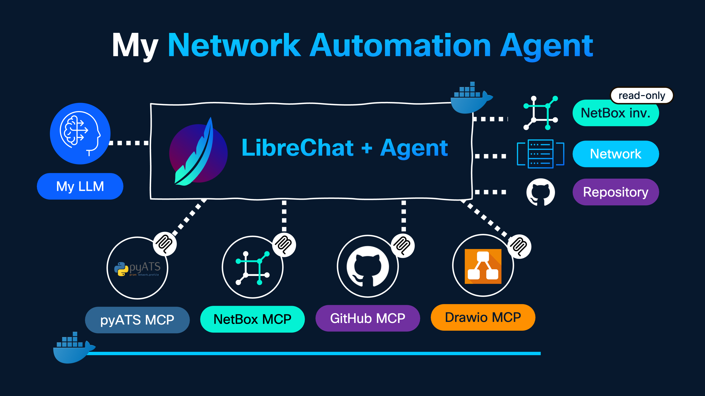

# Week 4: Intentions Matter

**Part of the [Month of Smart Connections Lab](https://github.com/ponchotitlan/month-of-smart-connections-lab)**

<div align="center">

</div>

Agentic AI automation for network operations using MCP (Model Context Protocol) servers, NetBox, pyATS, and GitHub. Describe what you want to do in plain language — let the agent figure out how to do it.

## Why Agentic AI for Network Automation?

Traditional automation scripts are great at repeating known tasks. But what happens when you need to reason across multiple tools, adapt to the current network state, or handle tasks that weren't scripted in advance? Agentic AI fills that gap:

- **Intent-Driven Workflows:** Describe the goal in natural language — the agent determines the sequence of actions
- **Multi-Tool Orchestration:** Chain NetBox queries, device connections, config pushes, and report generation automatically
- **Safety-First Execution:** The agent validates configurations against live device state and waits for your approval before making changes
- **Self-Documenting Outputs:** Save compliance reports, open GitHub issues, and generate network diagrams as part of the same conversation

This project wires together an AI assistant with a set of **MCP servers** so that all of these capabilities are available as natural-language commands.

## Model Context Protocol (MCP)

[MCP (Model Context Protocol)](https://modelcontextprotocol.io/) is an open standard that lets AI models discover and call external tools at runtime. Think of it as a universal plugin system for AI agents:

- Each MCP server exposes a well-defined set of **tools** the agent can invoke
- Tools are called with structured inputs and return structured results
- The AI client (e.g., LibreChat, Claude Desktop) acts as the orchestrator, deciding which tool to call based on the user's intent
- All four MCP servers in this project run as lightweight Docker containers, connected on a shared `mcp-net` bridge network

## Architecture Overview

| Component | Type | Description |
|-----------|------|-------------|
| **`AGENT.md`** | System Prompt | Instructions and rules loaded into the AI assistant at the start of every session |
| **`docker-compose.yml`** | Infrastructure | Spins up all four MCP servers as Docker containers |
| **`testbed.yaml`** | pyATS Testbed | Device inventory baseline for the Cisco Modeling Labs Always-On Sandbox |
| **`.env.example`** | Configuration | Template for all environment variables — copy to `.env` and fill in your values |
| **`compliance-reports/`** | Output Directory | Landing folder where the agent commits report files via GitHub MCP |

## MCP Servers

| Server | Access | Scope |
|--------|--------|-------|
| **NetBox MCP** | Read-only | Network source of truth: devices, platforms, IP addresses, credentials vault |
| **pyATS MCP** | Read/Write | Device testing, CLI command execution, testbed/inventory management |
| **GitHub MCP** | Read/Write | Repository operations: file commits, issue creation, pull requests |
| **DrawIO MCP** | Read/Write | Network diagram creation and editing |

> ⚠️ **GitHub access is scoped** to `ponchotitlan/month-of-smart-connections-lab` only.

## Agent Capabilities (AGENT.md)

The `AGENT.md` file is the **system prompt** loaded into your AI client. It defines the assistant's identity, tool usage rules, and safety guardrails.

| Capability | Trigger | Behavior |
|------------|---------|----------|
| `Show Device Inventory` | "Show me the inventory" | Syncs NetBox → pyATS, displays result from pyATS |
| `Execute CLI Commands` | "Run show interfaces on R1" | Reads current device state, executes read-only show commands |
| `Validate & Push Configs` | "Configure loopback on R2" | Fetches running config, checks for conflicts, shows dry-run, waits for approval |
| `Save Compliance Reports` | "Save the compliance report" | Commits file to `compliance-reports/` in the GitHub repository |
| `Create GitHub Issues` | "Open a ticket for high CPU on R1" | Creates an issue in the repo with title, body, and labels |
| `Generate Network Diagrams` | "Draw the core topology" | Creates diagram with DrawIO, renders Mermaid preview inline in chat |

## Setup

### 1. Clone and configure environment

```bash
# Navigate to directory
cd week-04-agentic-automation

# Copy the environment template
cp .env.example .env
```

Open `.env` and fill in your real values:

| Variable | Description |
|----------|-------------|
| `NETBOX_URL` | URL of your NetBox instance (reachable from containers) |
| `NETBOX_TOKEN` | NetBox API token (shared with pyATS vault integration) |
| `GITHUB_PAT` | GitHub fine-grained personal access token |
| `CREDENTIALS_VAULT_BASE_URL` | URL pyATS uses to retrieve device credentials from NetBox |

> **Don't have a NetBox instance?** You have two options:
>
> **Option A — Set up NetBox with the netbox-secrets plugin (full setup)**
>
> This project relies on NetBox having the [netbox-secrets](https://github.com/Onemind-Services-LLC/netbox-secrets) plugin enabled. The pyATS MCP server fetches device credentials from NetBox secrets stored under the roles `username` and `password` for each device. To set this up yourself on a local Docker NetBox, follow [this guide](netbox_secrets_setup.md).
>
> **Option B — Skip NetBox entirely and use the provided testbed (recommended for a quick start)**
>
> The included `testbed.yaml` already contains all devices from the **Cisco Modeling Labs Always-On Sandbox** on DevNet. Just [book the free sandbox](https://devnetsandbox.cisco.com) and connect via the provided VPN.
>
> When using `testbed.yaml`, replace the `pyats-mcp` service in `docker-compose.yml` with the simpler version below (no vault variables needed) and **remove the `netbox-mcp` service entirely**:
>
> ```yaml
> pyats-mcp:
>   build:
>     context: https://github.com/ponchotitlan/pyATS_MCP.git
>     dockerfile: Dockerfile
>   image: pyats-mcp:latest
>   container_name: pyats-mcp
>   environment:
>     MCP_TRANSPORT: ${PYATS_MCP_TRANSPORT}
>     MCP_HOST: ${PYATS_MCP_HOST}
>     MCP_PORT: ${PYATS_MCP_PORT}
>     PYATS_TESTBED_PATH: /app/testbed.yaml
>     PYATS_MCP_ARTIFACTS_DIR: /app/artifacts
>     PYATS_MCP_KEEP_ARTIFACTS: "1"
>   volumes:
>     - ./testbed.yaml:/app/testbed.yaml:ro
>     - pyats-mcp-artifacts:/app/artifacts
>   ports:
>     - "${PYATS_MCP_HOST}:${PYATS_MCP_HOST}"
>   networks:
>     - mcp-net
>   restart: unless-stopped
> ```

### 2. Start the MCP servers

```bash
docker compose up -d
```

This builds and starts four containers on the `mcp-net` bridge:

| Container | Default Port |
|-----------|-------------|
| `netbox-mcp` | `8080` |
| `pyats-mcp` | `8081` |
| `github-mcp` | `8082` |
| `drawio-mcp` | `8083` |

Verify all containers are running:

```bash
docker compose ps
```

### 3. (Optional) Load the testbed

The included `testbed.yaml` targets the **Cisco Modeling Labs Always-On Sandbox**. If you want to use it as a starting point for pyATS:

```bash
# Book the free sandbox at https://devnetsandbox.cisco.com
# Look for "Cisco Modeling Labs - Open NRE" and connect via the provided VPN
```

Adjust the IP addresses in `testbed.yaml` to match your sandbox allocation, or replace with your own devices.

### 4. Connect your AI client

Point your AI client (LibreChat, Claude Desktop, or any MCP-compatible client) to the four MCP server endpoints:

```json
{
  "mcpServers": {
    "netbox": { "url": "http://localhost:8080/sse" },
    "pyats":  { "url": "http://localhost:8081/sse" },
    "github": { "url": "http://localhost:8082/sse" },
    "drawio": { "url": "http://localhost:8083/sse" }
  }
}
```

> Our YouTube video [Ep.4: From Intent to Action with Agentic Automation](https://youtu.be/YCMW6qSJiD0) showcases how to do this with LibreChat's web

Load `AGENT.md` as the **system prompt** for your session.

## Running the Agent

Once connected, interact with the assistant in plain language. No commands to memorize — just describe your intent:

**Show inventory:**
```
Show me the current device inventory
```

**Audit a device:**
```
Run a compliance check on R1 and save the report
```

**Troubleshoot:**
```
Check the interface status on SW1 and SW2 and tell me if anything looks wrong
```

**Make a config change (safely):**
```
Add a loopback interface with IP 10.255.255.1/32 on R1
```

**Document the topology:**
```
Generate a diagram of all devices in the inventory
```

## Expected Output

After a typical session, the agent will have:

- Displayed device inventory synced from NetBox into pyATS
- Executed show commands and explained the output
- Validated a proposed configuration change against the running config and awaited your approval before pushing
- Committed a compliance report to `compliance-reports/` in this repository
- Opened a GitHub issue for any discovered anomalies
- Rendered a Mermaid diagram inline and offered to save the DrawIO source

**Example console output (docker compose):**

```
✔ Container netbox-mcp   Started
✔ Container pyats-mcp    Started
✔ Container github-mcp   Started
✔ Container drawio-mcp   Started
```

**Example agent interaction:**

```
User:   Show me the device inventory

Agent:  🔄 Syncing NetBox → pyATS...
        ✅ Sync complete. Inventory from pyATS:

        devices:
          R1:  os=iosxe  platform=iol  ip=10.10.20.171  protocol=telnet
          R2:  os=iosxe  platform=iol  ip=10.10.20.172  protocol=telnet
          SW1: os=iosxe  platform=iol  ip=10.10.20.173  protocol=telnet
          SW2: os=iosxe  platform=iol  ip=10.10.20.174  protocol=telnet

        Would you like me to run a connectivity check on any of these devices?
```

## Additional Resources

| Resource | Description |
|----------|-------------|
| [🤖 Model Context Protocol Specification](https://modelcontextprotocol.io/) | Official MCP documentation and SDK references |
| [📦 NetBox MCP Server](https://github.com/netboxlabs/netbox-mcp-server) | Source of the NetBox MCP server used in this project |
| [🐍 pyATS MCP Server with netbox-secrets support](https://github.com/ponchotitlan/pyATS_MCP/tree/netbox-secrets-support) | Custom pyATS MCP server with NetBox secrets integration |
| [🐙 GitHub MCP Server](https://github.com/modelcontextprotocol/servers/tree/main/src/github) | Official GitHub MCP server |
| [✏️ DrawIO MCP Server](https://github.com/drawio-app/mcp) | DrawIO MCP server for diagram generation |
| [📘 NetBox Documentation](https://netbox.readthedocs.io/) | NetBox setup, API, and token management |
| [🧪 pyATS Documentation](https://developer.cisco.com/docs/pyats/) | pyATS test framework reference |
| [🎓 LibreChat](https://www.librechat.ai/) | Open-source AI client with MCP support |

---
**⬅️ Previous Week:** [Week 3 - Trust Issues](../week-03-automation-testing/)</br>
**📚 Main Repository:** [Month of Smart Connections Lab](https://github.com/ponchotitlan/month-of-smart-connections-lab)
