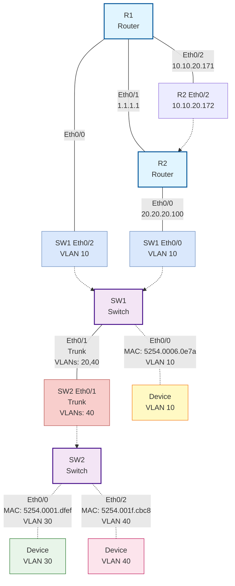

# L2 Network Topology Report

**Generated:** 2024
**Network Inventory:** R1, R2, SW1, SW2

---

## Network Topology Diagram

---

## Physical Connections

### Router-to-Router Links

| Source | Interface | Destination | Interface | IP Address (Source) | IP Address (Dest) |
|--------|-----------|-------------|-----------|---------------------|-------------------|
| R1 | Eth0/1 | R2 | Eth0/1 | 1.1.1.1 | 1.1.1.2 |
| R1 | Eth0/2 | R2 | Eth0/2 | 10.10.20.171 | 10.10.20.172 |

### Router-to-Switch Links

| Source | Interface | Destination | Interface | IP Address | VLAN |
|--------|-----------|-------------|-----------|------------|------|
| R1 | Eth0/0 | SW1 | Eth0/2 | - | 10 |
| R2 | Eth0/0 | SW1 | Eth0/0 | 20.20.20.100 | 10 |

### Inter-Switch Links

| Source | Interface | Destination | Interface | Type | VLANs Allowed |
|--------|-----------|-------------|-----------|------|---------------|
| SW1 | Eth0/1 | SW2 | Eth0/1 | Trunk | 20, 40 |

---

## VLAN Configuration

### SW1 VLAN Assignments

| VLAN ID | Description | Interfaces | MAC Addresses |
|---------|-------------|------------|---------------|
| 10 | Access VLAN | Eth0/0, Eth0/2 | 5254.0006.0e7a, aabb.cc00.0300 |
| 20 | Trunk VLAN | Eth0/1 | 5254.001c.5c2a |

### SW2 VLAN Assignments

| VLAN ID | Description | Interfaces | MAC Addresses |
|---------|-------------|------------|---------------|
| 30 | Access VLAN | Eth0/0 | 5254.0001.dfef |
| 40 | Trunk VLAN | Eth0/1, Eth0/2 | 5254.001f.cbc8, aabb.cc00.0400 |

---

## Device Inventory

| Device | Type | OS | Platform | Management IP | Connections |
|--------|------|----|---------|--------------| ------------|
| R1 | Router | iosxe | iol | 10.10.20.171 | Eth0/0, Eth0/1, Eth0/2 |
| R2 | Router | iosxe | iol | 10.10.20.172 | Eth0/0, Eth0/1, Eth0/2 |
| SW1 | Switch | iosxe | iol | 10.10.20.173 | Eth0/0, Eth0/1, Eth0/2, Eth0/3 |
| SW2 | Switch | iosxe | iol | 10.10.20.174 | Eth0/0, Eth0/1, Eth0/2, Eth0/3 |

---

## Discovery Method

- **CDP**: Used for R1-R2 neighbor discovery
- **MAC Address Tables**: Used for VLAN and switch connectivity mapping
- **Interface Status**: Used for active interface identification

**Notes:**
- CDP/LLDP are disabled on SW1 and SW2
- Topology derived from R2 CDP output and switch MAC address tables
- All data collected via pyATS automation

---

*Report generated by Devvie - Network Automation Assistant*
