# SW2 Interface Status Diagram

**Generated:** 2026-02-25  
**Device:** SW2 (10.10.20.174)  
**Platform:** Cisco IOS-XE 17.12.1  
**Type:** Layer 2/3 Switch

---

## 📊 Network Topology - SW2 Interface Status

```mermaid
graph TB
    subgraph SW2["<b>Switch: SW2</b><br/>IP: 10.10.20.174<br/>Platform: Cisco IOS-XE"]
        E0["<b>Ethernet0/0</b><br/>Status: ✅ UP/UP<br/>VLAN: 30<br/>Duplex: Full<br/>Speed: Auto<br/>Type: 10/100/1000BaseTX"]
        E1["<b>Ethernet0/1</b><br/>Status: ✅ UP/UP<br/>VLAN: 40<br/>Duplex: Full<br/>Speed: Auto<br/>Type: 10/100/1000BaseTX"]
        E2["<b>Ethernet0/2</b><br/>Status: ✅ UP/UP<br/>VLAN: 40<br/>Duplex: Full<br/>Speed: Auto<br/>Type: 10/100/1000BaseTX"]
        E3["<b>Ethernet0/3</b><br/>to port3.sandbox-backend<br/>Status: ✅ UP/UP<br/>IP: 10.10.20.174<br/>Mode: Routed<br/>Duplex: Full<br/>Speed: Auto<br/>Type: 10/100/1000BaseTX"]
        L0["<b>Loopback0</b><br/>Status: ❌ Admin Down"]
    end
    
    style E0 fill:#90EE90,stroke:#228B22,stroke-width:3px,color:#000
    style E1 fill:#90EE90,stroke:#228B22,stroke-width:3px,color:#000
    style E2 fill:#90EE90,stroke:#228B22,stroke-width:3px,color:#000
    style E3 fill:#87CEEB,stroke:#4682B4,stroke-width:3px,color:#000
    style L0 fill:#FFB6C1,stroke:#DC143C,stroke-width:3px,color:#000
    style SW2 fill:#F0F8FF,stroke:#000080,stroke-width:4px
```



---

## 📋 Detailed Interface Status Table

| Interface | Status | Protocol | IP Address | VLAN | Duplex | Speed | Type | Description |
|-----------|--------|----------|------------|------|--------|-------|------|-------------|
| **Ethernet0/0** | ✅ UP | ✅ UP | Unassigned | 30 | Full | Auto | 10/100/1000BaseTX | - |
| **Ethernet0/1** | ✅ UP | ✅ UP | Unassigned | 40 | Full | Auto | 10/100/1000BaseTX | - |
| **Ethernet0/2** | ✅ UP | ✅ UP | Unassigned | 40 | Full | Auto | 10/100/1000BaseTX | - |
| **Ethernet0/3** | ✅ UP | ✅ UP | 10.10.20.174 | Routed | Full | Auto | 10/100/1000BaseTX | to port3.sandbox-backend |
| **Loopback0** | ❌ Admin Down | ❌ Down | Unassigned | - | - | - | Virtual | - |

---

## 📊 Summary Statistics

| Metric | Value |
|--------|-------|
| **Total Interfaces** | 5 (4 physical + 1 virtual) |
| **Operational (Up/Up)** | 4 interfaces ✅ |
| **Administratively Down** | 1 interface ❌ |
| **VLAN 30 Members** | 1 interface (E0/0) |
| **VLAN 40 Members** | 2 interfaces (E0/1, E0/2) |
| **Routed Interfaces** | 1 interface (E0/3 - Management) |
| **Overall Health** | ✅ 100% of active interfaces operational |

---

## 🔍 Key Observations

### ✅ Strengths
1. **All Physical Interfaces Operational** - E0/0 through E0/3 are up/up with no errors
2. **Consistent Configuration** - All interfaces using full duplex and auto-negotiation
3. **VLAN Segmentation** - Proper separation between VLAN 30 and VLAN 40
4. **Management Access** - Dedicated routed interface (E0/3) for device management

### 📝 Configuration Details

#### VLAN 30 - Single Interface
- **Ethernet0/0** - Access port in VLAN 30
- Purpose: Dedicated network segment

#### VLAN 40 - Port Group
- **Ethernet0/1** - Access port in VLAN 40
- **Ethernet0/2** - Access port in VLAN 40
- Purpose: Shared network segment (possibly redundant links or separate devices)

#### Management Interface
- **Ethernet0/3** - Layer 3 routed interface
- IP Address: 10.10.20.174/24
- Description: "to port3.sandbox-backend"
- Purpose: Out-of-band management connectivity

### ⚠️ Recommendations

1. **Loopback0 Interface**
   - Currently administratively shutdown
   - Consider configuring and enabling if needed for routing protocols (OSPF/BGP router-id) or management
   - Recommend: `interface Loopback0` → `ip address <management-ip> 255.255.255.255` → `no shutdown`

2. **Interface Descriptions**
   - E0/0, E0/1, E0/2 lack descriptions
   - Best practice: Add descriptive labels for documentation
   - Example: `interface Ethernet0/0` → `description <connected-device>`

3. **VLAN Documentation**
   - Document the purpose of VLAN 30 and VLAN 40
   - Verify these VLANs exist in the VLAN database with proper names

---

## 🔧 Interface Configuration Commands (Reference)

### Show Commands Used
```
SW2# show ip interface brief
SW2# show interfaces status
```

### Sample Output - IP Interface Brief
```
Interface              IP-Address      OK? Method Status                Protocol
Ethernet0/0            unassigned      YES unset  up                    up      
Ethernet0/1            unassigned      YES unset  up                    up      
Ethernet0/2            unassigned      YES unset  up                    up      
Ethernet0/3            10.10.20.174    YES TFTP   up                    up      
Loopback0              unassigned      YES unset  administratively down down
```

### Sample Output - Interface Status
```
Port         Name               Status       Vlan       Duplex  Speed Type
Et0/0                           connected    30           full   auto 10/100/1000BaseTX
Et0/1                           connected    40           full   auto 10/100/1000BaseTX
Et0/2                           connected    40           full   auto 10/100/1000BaseTX
Et0/3        to port3.sandbox-b connected    routed       full   auto 10/100/1000BaseTX
```

---

## 📚 Related Documentation

- Device Inventory: All devices in MonthOfSmartConnectionsLab
- Network Topology: Full lab topology diagram
- VLAN Database: Complete VLAN assignments across switches

---

## 🔄 Change History

| Date | Change | Performed By |
|------|--------|--------------|
| 2026-02-25 | Initial interface status documentation | Network Automation Assistant |

---

## 📞 Support

For questions or configuration changes, reference this document when creating GitHub issues or contacting the network team.

**Device Details:**
- **Hostname:** SW2
- **Management IP:** 10.10.20.174
- **Connection:** Telnet (port 23)
- **Site:** MonthOfSmartConnectionsLab