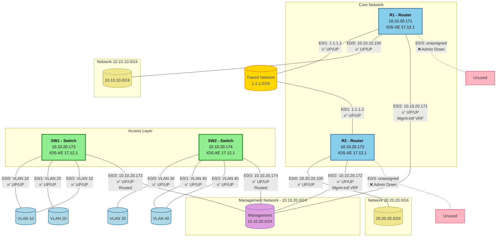

# Network Topology Diagram - MonthOfSmartConnectionsLab

**Generated:** 2026-02-25  
**Scope:** Complete network topology with interface status  
**Devices:** R1, R2, SW1, SW2

---

## 🌐 Network Topology Overview



---

## 📊 Device-to-Device Connection Matrix

| Source Device | Interface | IP Address | Status | Destination | Interface | IP Address | Status |
|--------------|-----------|------------|--------|-------------|-----------|------------|--------|
| **R1** | E0/1 | 1.1.1.1 | ✅ UP/UP | **R2** | E0/1 | 1.1.1.2 | ✅ UP/UP |
| **R1** | E0/0 | 10.10.10.100 | ✅ UP/UP | Network | - | 10.10.10.0/24 | - |
| **R1** | E0/2 | 10.10.20.171 | ✅ UP/UP | Management | - | 10.10.20.0/24 | ✅ UP |
| **R2** | E0/0 | 20.20.20.100 | ✅ UP/UP | Network | - | 20.20.20.0/24 | - |
| **R2** | E0/2 | 10.10.20.172 | ✅ UP/UP | Management | - | 10.10.20.0/24 | ✅ UP |
| **SW1** | E0/3 | 10.10.20.173 | ✅ UP/UP | Management | - | 10.10.20.0/24 | ✅ UP |
| **SW2** | E0/3 | 10.10.20.174 | ✅ UP/UP | Management | - | 10.10.20.0/24 | ✅ UP |

---

## 🔍 Detailed Interface Status

### Router R1 (10.10.20.171)

| Interface | IP Address | Status | Protocol | Network | Description |
|-----------|------------|--------|----------|---------|-------------|
| E0/0 | 10.10.10.100 | ✅ UP | ✅ UP | 10.10.10.0/24 | Local network |
| E0/1 | 1.1.1.1 | ✅ UP | ✅ UP | 1.1.1.0/24 | Transit to R2 |
| E0/2 | 10.10.20.171 | ✅ UP | ✅ UP | Mgmt-intf VRF | Management |
| E0/3 | Unassigned | ❌ Admin Down | ❌ Down | - | Unused |

### Router R2 (10.10.20.172)

| Interface | IP Address | Status | Protocol | Network | Description |
|-----------|------------|--------|----------|---------|-------------|
| E0/0 | 20.20.20.100 | ✅ UP | ✅ UP | 20.20.20.0/24 | Local network |
| E0/1 | 1.1.1.2 | ✅ UP | ✅ UP | 1.1.1.0/24 | Transit to R1 |
| E0/2 | 10.10.20.172 | ✅ UP | ✅ UP | Mgmt-intf VRF | Management |
| E0/3 | Unassigned | ❌ Admin Down | ❌ Down | - | Unused |

### Switch SW1 (10.10.20.173)

| Interface | IP Address | Status | Protocol | VLAN | Mode | Description |
|-----------|------------|--------|----------|------|------|-------------|
| E0/0 | Unassigned | ✅ UP | ✅ UP | 10 | Access | VLAN 10 |
| E0/1 | Unassigned | ✅ UP | ✅ UP | 20 | Access | VLAN 20 |
| E0/2 | Unassigned | ✅ UP | ✅ UP | 10 | Access | VLAN 10 |
| E0/3 | 10.10.20.173 | ✅ UP | ✅ UP | Routed | L3 | Management |
| Loopback0 | Unassigned | ❌ Admin Down | ❌ Down | - | Virtual | Unused |

### Switch SW2 (10.10.20.174)

| Interface | IP Address | Status | Protocol | VLAN | Mode | Description |
|-----------|------------|--------|----------|------|------|-------------|
| E0/0 | Unassigned | ✅ UP | ✅ UP | 30 | Access | VLAN 30 |
| E0/1 | Unassigned | ✅ UP | ✅ UP | 40 | Access | VLAN 40 |
| E0/2 | Unassigned | ✅ UP | ✅ UP | 40 | Access | VLAN 40 |
| E0/3 | 10.10.20.174 | ✅ UP | ✅ UP | Routed | L3 | Management |
| Loopback0 | Unassigned | ❌ Admin Down | ❌ Down | - | Virtual | Unused |

---

## 📡 Network Segments

### Management Network (10.10.20.0/24)
- **Purpose:** Out-of-band management
- **VRF:** Mgmt-intf
- **Connected Devices:**
  - R1: E0/2 (10.10.20.171) ✅
  - R2: E0/2 (10.10.20.172) ✅
  - SW1: E0/3 (10.10.20.173) ✅
  - SW2: E0/3 (10.10.20.174) ✅

### Transit Network (1.1.1.0/24)
- **Purpose:** Inter-router connectivity
- **Type:** Point-to-point
- **Endpoints:**
  - R1: E0/1 (1.1.1.1) ✅
  - R2: E0/1 (1.1.1.2) ✅

### User Networks
- **10.10.10.0/24:** Connected via R1 E0/0 ✅
- **20.20.20.0/24:** Connected via R2 E0/0 ✅

### VLANs on SW1
- **VLAN 10:** E0/0, E0/2 (2 ports) ✅
- **VLAN 20:** E0/1 (1 port) ✅

### VLANs on SW2
- **VLAN 30:** E0/0 (1 port) ✅
- **VLAN 40:** E0/1, E0/2 (2 ports) ✅

---

## 🔗 Routing Summary

### Router R1
- **Static Route:** 20.20.20.0/24 via 1.1.1.2 (next-hop R2)
- **Management Route:** 0.0.0.0/0 via 10.10.20.254 (VRF Mgmt-intf)

### Router R2
- **Static Route:** 10.10.10.0/24 via 1.1.1.1 (next-hop R1)
- **Management Route:** 0.0.0.0/0 via 10.10.20.254 (VRF Mgmt-intf)

---

## 📈 Network Health Summary

| Metric | Count | Status |
|--------|-------|--------|
| **Total Devices** | 4 | All online ✅ |
| **Total Physical Interfaces** | 18 | - |
| **Operational Interfaces** | 14 | ✅ UP/UP |
| **Down Interfaces** | 2 | ❌ Admin down (R1-E0/3, R2-E0/3) |
| **Virtual Interfaces Down** | 2 | ❌ Admin down (SW1-Lo0, SW2-Lo0) |
| **Active VLANs** | 4 | VLAN 10, 20, 30, 40 |
| **Management Connectivity** | 100% | All devices reachable ✅ |
| **Router-to-Router Link** | 100% | Transit network operational ✅ |

---

## 🔍 Key Topology Insights

### ✅ Strengths
1. **Dual Router Core** - R1 and R2 provide routing services
2. **Separate Management Network** - Out-of-band management via VRF
3. **Transit Network** - Dedicated inter-router link (1.1.1.0/24)
4. **VLAN Segmentation** - SW1 and SW2 have distinct VLANs
5. **Full Management Coverage** - All devices accessible via 10.10.20.0/24

### ⚠️ Observations
1. **No Redundancy** - Single link between R1 and R2 (potential SPOF)
2. **No Inter-Switch Links** - SW1 and SW2 are isolated from each other
3. **Unused Interfaces** - E0/3 on both routers administratively down
4. **Loopback Interfaces Down** - SW1 and SW2 Loopback0 not configured
5. **No Trunk Links Visible** - Switches appear to operate independently

### 💡 Recommendations
1. **Add Redundancy:** Create secondary link between R1 and R2
2. **Connect Switches:** Add trunk link between SW1 and SW2
3. **Enable Loopbacks:** Configure SW1 and SW2 Loopback0 for management IPs
4. **Dynamic Routing:** Consider implementing OSPF or EIGRP for scalability
5. **Monitor Links:** Implement SNMP or NetFlow for link utilization

---

## 📋 Legend

| Symbol | Meaning |
|--------|---------|
| ✅ UP/UP | Interface operational (line protocol up) |
| ❌ Admin Down | Interface administratively shut down |
| 🔵 Router | Layer 3 routing device |
| 🟢 Switch | Layer 2/3 switching device |
| 🟡 Transit | Inter-device link |
| 🟣 Management | OOB management network |
| 🟨 Network | End-user/service network |
| 🔷 VLAN | Virtual LAN segment |

---

## 📅 Document Information

**Generated By:** Network Automation Assistant  
**Data Collection Date:** 2026-02-25  
**NetBox Sync:** Yes  
**pyATS Verification:** Yes  
**Devices Audited:** 4 (R1, R2, SW1, SW2)

---

## 🔧 Commands Used for Data Collection

```bash
# Interface status
show ip interface brief
show interfaces status

# Routing
show ip route

# VLANs (switches)
show vlan brief

# CDP/LLDP (if available)
show cdp neighbors
show lldp neighbors
```

---

**End of Topology Diagram Report**
