# Network Topology Report
**Generated:** 2024-01-XX  
**Source:** NetBox + pyATS Live Device Query  
**Site:** MonthOfSmartConnectionsLab

---

## 🌐 Executive Summary

This report documents the current network topology, including all active devices, interface status, physical connections, and connectivity analysis for the MonthOfSmartConnectionsLab infrastructure.

### Network Overview
- **Total Devices:** 4 (2 Routers, 2 Switches)
- **Active Interfaces:** 16
- **Physical Connections:** 2 verified links (R1-R2)
- **Management Network:** 10.10.20.0/24
- **Overall Health:** ✅ Operational

---

## 📊 Network Topology Diagram

```mermaid
graph TB
    subgraph Management_Network["🌐 Management Network - 10.10.20.0/24"]
        mgmt_cloud["Management<br/>Network"]
    end
    
    subgraph Core_Routers["🔷 Core Routers"]
        R1["<b>R1</b> 🖥️<br/>Router<br/>10.10.20.171<br/>Status: ✅ Active"]
        R2["<b>R2</b> 🖥️<br/>Router<br/>10.10.20.172<br/>Status: ✅ Active"]
    end
    
    subgraph Access_Switches["🔶 Access Switches"]
        SW1["<b>SW1</b> 🔀<br/>Switch<br/>10.10.20.173<br/>Status: ✅ Active"]
        SW2["<b>SW2</b> 🔀<br/>Switch<br/>10.10.20.174<br/>Status: ✅ Active"]
    end
    
    subgraph External_Networks["🌍 External Networks"]
        net1["Network<br/>10.10.10.0/24"]
        net2["Network<br/>20.20.20.0/24"]
    end
    
    %% R1-R2 Interconnection
    R1 ---|"Eth0/1: 1.1.1.1<br/>✅ UP/UP"| link1[" "]
    link1 ---|"Eth0/1: 1.1.1.2<br/>✅ UP/UP"| R2
    
    R1 ---|"Eth0/2<br/>✅ UP/UP<br/>Management"| mgmt_link[" "]
    mgmt_link ---|"Eth0/2<br/>✅ UP/UP<br/>Management"| R2
    
    %% External connections
    R1 ---|"Eth0/0: 10.10.10.100<br/>✅ UP/UP"| net1
    R2 ---|"Eth0/0: 20.20.20.100<br/>✅ UP/UP"| net2
    
    %% Management connections
    R1 -.->|"Eth0/2: 10.10.20.171<br/>✅ UP/UP"| mgmt_cloud
    R2 -.->|"Eth0/2: 10.10.20.172<br/>✅ UP/UP"| mgmt_cloud
    SW1 -.->|"Eth0/3: 10.10.20.173<br/>✅ UP/UP"| mgmt_cloud
    SW2 -.->|"Eth0/3: 10.10.20.174<br/>✅ UP/UP"| mgmt_cloud
    
    style R1 fill:#90EE90,stroke:#2E8B57,stroke-width:3px
    style R2 fill:#90EE90,stroke:#2E8B57,stroke-width:3px
    style SW1 fill:#FFD700,stroke:#DAA520,stroke-width:3px
    style SW2 fill:#FFD700,stroke:#DAA520,stroke-width:3px
    style mgmt_cloud fill:#87CEEB,stroke:#4682B4,stroke-width:2px
    style net1 fill:#FFB6C1,stroke:#DB7093,stroke-width:2px
    style net2 fill:#FFB6C1,stroke:#DB7093,stroke-width:2px
    style link1 fill:none,stroke:none
    style mgmt_link fill:none,stroke:none
    
    linkStyle 0 stroke:#2E8B57,stroke-width:3px
    linkStyle 1 stroke:#2E8B57,stroke-width:3px
    linkStyle 2 stroke:#FF8C00,stroke-width:2px,stroke-dasharray: 5 5
    linkStyle 3 stroke:#FF8C00,stroke-width:2px,stroke-dasharray: 5 5
    linkStyle 4 stroke:#4169E1,stroke-width:2px
    linkStyle 5 stroke:#4169E1,stroke-width:2px
    linkStyle 6 stroke:#B0C4DE,stroke-width:2px,stroke-dasharray: 3 3
    linkStyle 7 stroke:#B0C4DE,stroke-width:2px,stroke-dasharray: 3 3
    linkStyle 8 stroke:#B0C4DE,stroke-width:2px,stroke-dasharray: 3 3
    linkStyle 9 stroke:#B0C4DE,stroke-width:2px,stroke-dasharray: 3 3
```



---

## 📋 Device Inventory

### Routers

| Device | Model | Platform | OS | Primary IP | Status | Protocol |
|--------|-------|----------|----|-----------:|--------|----------|
| **R1** | Cisco IOS-XE | IOL | iosxe | 10.10.20.171/32 | ✅ Active | telnet |
| **R2** | Cisco IOS-XE | IOL | iosxe | 10.10.20.172/32 | ✅ Active | telnet |

### Switches

| Device | Model | Platform | OS | Primary IP | Status | Protocol |
|--------|-------|----------|----|-----------:|--------|----------|
| **SW1** | Cisco IOS-XE | IOL | iosxe | 10.10.20.173/32 | ✅ Active | telnet |
| **SW2** | Cisco IOS-XE | IOL | iosxe | 10.10.20.174/32 | ✅ Active | telnet |

---

## 🔗 Physical Connectivity

### Verified Connections (via CDP)

| Source Device | Source Interface | Source IP | Status | Destination Device | Destination Interface | Destination IP | Status |
|---------------|------------------|-----------|--------|--------------------|-----------------------|----------------|--------|
| **R1** | Ethernet0/1 | 1.1.1.1 | 🟢 UP/UP | **R2** | Ethernet0/1 | 1.1.1.2 | 🟢 UP/UP |
| **R1** | Ethernet0/2 | 10.10.20.171 | 🟢 UP/UP | **R2** | Ethernet0/2 | 10.10.20.172 | 🟢 UP/UP |

**Connection Type:** Direct point-to-point links  
**Discovery Protocol:** CDP (Cisco Discovery Protocol)  
**Link Health:** All links operational with UP/UP status

---

## 🔌 Interface Status Report

### R1 - Router

| Interface | IP Address | Status | Protocol | Description |
|-----------|------------|--------|----------|-------------|
| Ethernet0/0 | 10.10.10.100 | 🟢 UP | 🟢 UP | External Network Connection |
| Ethernet0/1 | 1.1.1.1 | 🟢 UP | 🟢 UP | Link to R2 (Data) |
| Ethernet0/2 | 10.10.20.171 | 🟢 UP | 🟢 UP | Management / Link to R2 |
| Ethernet0/3 | unassigned | ⚪ Admin Down | 🔴 Down | Disabled |
| Loopback100 | 10.0.0.1 | 🟢 UP | 🟢 UP | Loopback Interface |

**Summary:** 4/5 interfaces operational

---

### R2 - Router

| Interface | IP Address | Status | Protocol | Description |
|-----------|------------|--------|----------|-------------|
| Ethernet0/0 | 20.20.20.100 | 🟢 UP | 🟢 UP | External Network Connection |
| Ethernet0/1 | 1.1.1.2 | 🟢 UP | 🟢 UP | Link to R1 (Data) |
| Ethernet0/2 | 10.10.20.172 | 🟢 UP | 🟢 UP | Management / Link to R1 |
| Ethernet0/3 | unassigned | ⚪ Admin Down | 🔴 Down | Disabled |

**Summary:** 3/4 interfaces operational

---

### SW1 - Switch

| Interface | IP Address | Status | Protocol | Description |
|-----------|------------|--------|----------|-------------|
| Ethernet0/0 | unassigned | 🟢 UP | 🟢 UP | Layer 2 Port (CDP disabled) |
| Ethernet0/1 | unassigned | 🟢 UP | 🟢 UP | Layer 2 Port (CDP disabled) |
| Ethernet0/2 | unassigned | 🟢 UP | 🟢 UP | Layer 2 Port (CDP disabled) |
| Ethernet0/3 | 10.10.20.173 | 🟢 UP | 🟢 UP | Management Interface |
| Loopback0 | unassigned | ⚪ Admin Down | 🔴 Down | Disabled |

**Summary:** 4/5 interfaces operational  
⚠️ **Note:** CDP is not enabled - physical connections not discoverable

---

### SW2 - Switch

| Interface | IP Address | Status | Protocol | Description |
|-----------|------------|--------|----------|-------------|
| Ethernet0/0 | unassigned | 🟢 UP | 🟢 UP | Layer 2 Port (CDP disabled) |
| Ethernet0/1 | unassigned | 🟢 UP | 🟢 UP | Layer 2 Port (CDP disabled) |
| Ethernet0/2 | unassigned | 🟢 UP | 🟢 UP | Layer 2 Port (CDP disabled) |
| Ethernet0/3 | 10.10.20.174 | 🟢 UP | 🟢 UP | Management Interface |
| Loopback0 | unassigned | ⚪ Admin Down | 🔴 Down | Disabled |

**Summary:** 4/5 interfaces operational  
⚠️ **Note:** CDP is not enabled - physical connections not discoverable

---

## 🌐 Network Segments

### Management Network
- **Network:** 10.10.20.0/24
- **Gateway:** Unknown
- **Connected Devices:** All 4 devices
- **Purpose:** Device management and monitoring

### Data Networks
- **R1 External:** 10.10.10.0/24 (10.10.10.100)
- **R2 External:** 20.20.20.0/24 (20.20.20.100)
- **R1-R2 Interconnect:** 1.1.1.0/30 (1.1.1.1 ↔ 1.1.1.2)

---

## 🔍 Discovery Protocol Analysis

### CDP Status

| Device | CDP Status | Neighbors Discovered | Visibility |
|--------|------------|---------------------|------------|
| **R1** | ✅ Enabled | 2 (R2 via Eth0/1, R2 via Eth0/2) | Full |
| **R2** | ✅ Enabled | 2 (R1 via Eth0/1, R1 via Eth0/2) | Full |
| **SW1** | ❌ Disabled | 0 | None |
| **SW2** | ❌ Disabled | 0 | None |

**Impact:** Switch-to-device connections cannot be automatically discovered. Physical cable documentation or LLDP required for complete visibility.

---

## ⚠️ Findings and Recommendations

### Critical Observations

1. ✅ **Core Router Redundancy:** R1 and R2 have dual connections (data + management path)
2. ⚠️ **Switch Visibility:** CDP disabled on SW1 and SW2 - connections to routers/other devices unknown
3. ✅ **Interface Health:** All operational interfaces showing UP/UP status
4. ⚠️ **Unused Capacity:** Multiple interfaces administratively down (optimization opportunity)

### Recommendations

#### High Priority
1. **Enable CDP on Switches**
   ```
   SW1(config)# cdp run
   SW2(config)# cdp run
   ```
   *Benefit:* Full topology discovery and automated documentation

2. **Document Physical Connections**
   - Update NetBox with cable records between switches and other devices
   - Verify and document SW1/SW2 Eth0/0-0/2 connections

#### Medium Priority
3. **Standardize Discovery Protocol**
   - Consider enabling LLDP for multi-vendor compatibility
   - Implement consistent discovery protocol policy

4. **Interface Optimization**
   - Review disabled interfaces (Eth0/3 on routers, Loopback0 on switches)
   - Determine if they should be utilized or remain disabled

5. **Management Network Segregation**
   - Verify management network is properly secured
   - Consider implementing management ACLs

#### Low Priority
6. **IP Addressing Consistency**
   - Document IP addressing scheme and subnet allocations
   - Create IPAM records in NetBox for all networks

---

## 📊 Health Summary

| Metric | Status | Details |
|--------|--------|---------|
| Device Availability | ✅ 100% | All 4 devices reachable |
| Interface Operational | ✅ 93% | 15/16 operational interfaces |
| Core Redundancy | ✅ Dual Path | R1-R2 connected via 2 links |
| Discovery Protocol | ⚠️ Partial | Enabled on routers only |
| Documentation | ⚠️ Partial | Switch connections not documented |

**Overall Assessment:** Network is operational and healthy. Primary gap is switch-level topology visibility.

---

## 📝 Appendix

### Raw CDP Output

#### R1 CDP Neighbors
```
Device ID        Local Intrfce     Holdtme    Capability  Platform  Port ID
R2.virl.info     Eth 0/1           131               R    Linux Uni Eth 0/1
R2.virl.info     Eth 0/2           164               R    Linux Uni Eth 0/2

Total cdp entries displayed : 2
```

#### R2 CDP Neighbors
```
Device ID        Local Intrfce     Holdtme    Capability  Platform  Port ID
R1.virl.info     Eth 0/1           147               R    Linux Uni Eth 0/1
R1.virl.info     Eth 0/2           128               R    Linux Uni Eth 0/2

Total cdp entries displayed : 2
```

#### SW1 CDP Status
```
% CDP is not enabled
```

#### SW2 CDP Status
```
% CDP is not enabled
```

---

## 🔧 Data Collection Methods

- **Inventory Source:** NetBox API (read-only)
- **Live Status:** pyATS CLI execution
- **Commands Used:**
  - `show ip interface brief`
  - `show cdp neighbors`
- **Discovery Protocol:** CDP (Cisco Discovery Protocol)
- **Verification:** Real-time device polling

---

**Report End**

*For questions or updates, please create an issue in the GitHub repository.*
