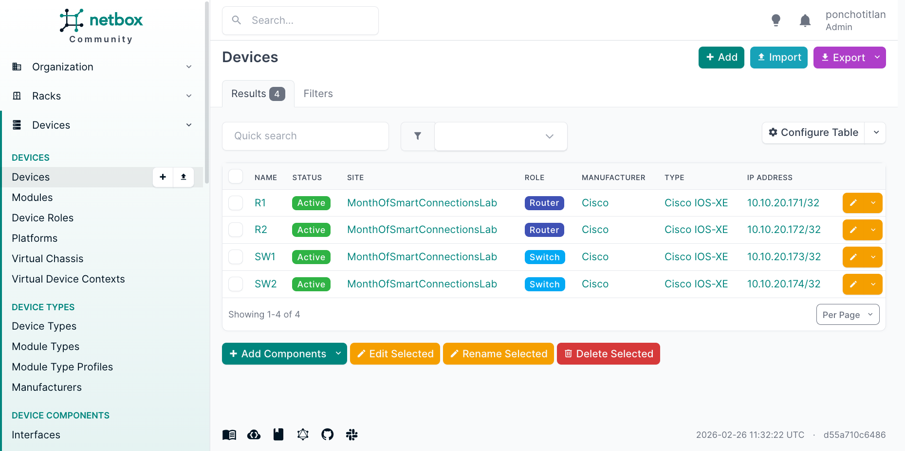
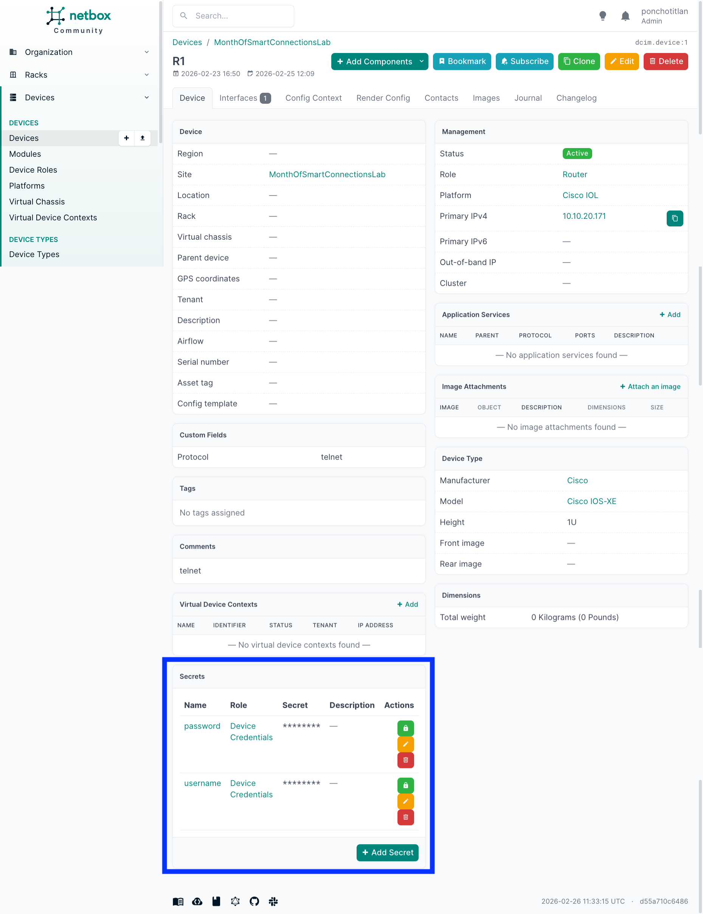

# NetBox Device Onboarding Guide

This guide covers how to onboard network devices into NetBox and configure the `netbox-secrets` plugin to store credentials, ready for pyATS testbed generation.

---

## 1. NetBox Docker Setup with netbox-secrets Plugin

### 1.1 Clone netbox-docker

```bash
git clone https://github.com/netbox-community/netbox-docker.git
cd netbox-docker
```

### 1.2 Create `plugin_requirements.txt`

```
netbox-secrets
```

### 1.3 Create `Dockerfile-Plugins`

```dockerfile
FROM netboxcommunity/netbox:latest

COPY ./plugin_requirements.txt /opt/netbox/
RUN /usr/local/bin/uv pip install -r /opt/netbox/plugin_requirements.txt

COPY configuration/configuration.py /etc/netbox/config/configuration.py
COPY configuration/plugins.py /etc/netbox/config/plugins.py
RUN DEBUG="true" SECRET_KEY="dummydummydummydummydummydummydummydummydummydummy" \
    /opt/netbox/venv/bin/python /opt/netbox/netbox/manage.py collectstatic --no-input
```

### 1.4 Create `configuration/plugins.py`

```python
PLUGINS = ["netbox_secrets"]
```

### 1.5 Create `docker-compose.override.yml`

```yaml
services:
  netbox:
    image: netbox:latest-plugins
    pull_policy: never
    ports:
      - 8000:8080
    build:
      context: .
      dockerfile: Dockerfile-Plugins
  netbox-worker:
    image: netbox:latest-plugins
    pull_policy: never
```

### 1.6 Build and Start

```bash
docker compose build --no-cache
docker compose up -d
```

### 1.7 Run Migrations

```bash
docker compose exec netbox /opt/netbox/venv/bin/python /opt/netbox/netbox/manage.py migrate
```

---

## 2. Pre-Configuration in the NetBox UI

Create these objects **in order** before importing devices. All values must match exactly.

### 2.1 Site
**Organization → Sites → Add**

| Field | Value |
|---|---|
| Name | MonthOfSmartConnectionsLab |
| Slug | monthofsmartconnectionslab |

### 2.2 Manufacturer
**Devices → Manufacturers → Add**

| Field | Value |
|---|---|
| Name | Cisco |
| Slug | cisco |

### 2.3 Device Type
**Devices → Device Types → Add**

| Field | Value |
|---|---|
| Manufacturer | Cisco |
| Model | IOL Generic |
| Slug | iol-generic |

### 2.4 Device Roles
**Devices → Device Roles → Add** — create two roles:

| Name | Slug |
|---|---|
| Router | router |
| Switch | switch |

### 2.5 Platform
**Devices → Platforms → Add**

| Field | Value |
|---|---|
| Name | Cisco IOS-XE |
| Slug | cisco-ios-xe |
| NAPALM Driver | iosxe |

### 2.6 Secret Role
**Secrets → Secret Roles → Add**

| Field | Value |
|---|---|
| Name | Device Credentials |
| Slug | device-credentials |

---

## 3. Import Devices via CSV

Go to **Devices → Devices → Import** and paste the following CSV. Use the exact object **names** (not slugs) for `device_type` and `platform` — the CSV importer matches by name in NetBox v4.x.

```csv
name,site,role,device_type,manufacturer,platform,status,comments
R1,MonthOfSmartConnectionsLab,Router,IOL Generic,Cisco,Cisco IOS-XE,active,telnet
R2,MonthOfSmartConnectionsLab,Router,IOL Generic,Cisco,Cisco IOS-XE,active,telnet
SW1,MonthOfSmartConnectionsLab,Switch,IOL Generic,Cisco,Cisco IOS-XE,active,telnet
SW2,MonthOfSmartConnectionsLab,Switch,IOL Generic,Cisco,Cisco IOS-XE,active,telnet
```

> **Note:** The `comments` field carries the connection protocol (`telnet`) to avoid custom fields. The CSV importer in NetBox v4.x matches `device_type` and `platform` by name, not slug.

---

## 4. Add Interfaces to Each Device

In NetBox v4.x, IP addresses must be assigned to an interface — they cannot be assigned directly to a device.

For each device (R1, R2, SW1, SW2):

**Devices → Devices → \<device\> → Interfaces tab → Add**

| Field | Value |
|---|---|
| Name | Management |
| Type | Virtual |

---

## 5. Assign IP Addresses

For each device, assign the IP via the interface:

**Devices → Devices → \<device\> → Interfaces tab → click Management → Add IP Address**

| Device | IP Address |
|---|---|
| R1 | 10.10.20.171/32 |
| R2 | 10.10.20.172/32 |
| SW1 | 10.10.20.173/32 |
| SW2 | 10.10.20.174/32 |

---

## 6. Set Primary IPv4 on Each Device

**Devices → Devices → \<device\> → Edit**

Set the **Primary IPv4** field to the IP address assigned in the previous step and click **Save**.

> The Primary IPv4 dropdown will only show IPs that are already assigned to an interface on that device. If it appears empty, go back and complete Step 5 first.

---

## 7. Add Secrets (Credentials)

For each device, add two secrets via **Secrets → Secrets → Add**:

**Username secret:**

| Field | Value |
|---|---|
| Assigned Object | \<device name\> |
| Role | Device Credentials |
| Name | username |
| Plaintext | cisco |

**Password secret:**

| Field | Value |
|---|---|
| Assigned Object | \<device name\> |
| Role | Device Credentials |
| Name | password |
| Plaintext | cisco |

Repeat for R1, R2, SW1, SW2.

<div align="center">


</div>

---

## 8. Create a Privileged User for MCP

### 8.1 Create the Superuser via CLI

Run this command against the running NetBox container:

```bash
docker compose exec -e DJANGO_SUPERUSER_PASSWORD=yourpassword netbox \
  /opt/netbox/venv/bin/python /opt/netbox/netbox/manage.py createsuperuser \
  --username mcp-user \
  --email mcp-user@lab.local \
  --noinput
```

Or interactively if you prefer to be prompted for the password:

```bash
docker compose exec netbox /opt/netbox/venv/bin/python /opt/netbox/netbox/manage.py createsuperuser
```

> This creates a fully privileged superuser with read/write access to all NetBox objects and the secrets plugin. Replace `yourpassword` with a strong password.

### 8.2 (Optional) Read-Only Permissions Instead of Superuser

If you prefer a least-privilege approach, create a regular user via the CLI and assign permissions manually in the UI:

**Admin → Permissions → Add**

| Field | Value |
|---|---|
| Name | MCP Read-Only |
| Actions | `view` only |
| Object Types | Select all relevant types (dcim.device, ipam.ipaddress, extras.secret, etc.) |
| Users | mcp-user |

---

## 9. Generate RSA Keys for netbox-secrets

The `netbox-secrets` plugin uses RSA key pairs to encrypt and decrypt secrets. Each user that needs to read secrets must have a public key registered in NetBox.

### 9.1 Generate the RSA Key Pair (on your local machine)

```bash
# Generate a 4096-bit private key
openssl genrsa -out mcp-user.key 4096

# Extract the public key
openssl rsa -in mcp-user.key -pubout -o mcp-user.pub
```

Keep `mcp-user.key` safe — it never leaves your machine. Only the public key goes into NetBox.

### 9.2 Register the Public Key in NetBox

**Secrets → User Keys → Add**

| Field | Value |
|---|---|
| User | mcp-user |
| Public Key | *(paste the contents of `mcp-user.pub`)* |

Click **Save**.

> NetBox will use this public key to encrypt a session key whenever `mcp-user` requests secrets. The private key on your machine is used to decrypt it.

---

## 10. Generate an API Token

### 10.1 Create the Token
**Admin → API Tokens → Add**

| Field | Value |
|---|---|
| User | mcp-user |
| Expires | *(optional, leave blank for no expiry)* |
| Write Enabled | ❌ *(uncheck for read-only MCP access)* |
| Description | MCP Server Token |

Click **Save** and **copy the token immediately** — it will not be shown again.

### 10.2 Verify the Token Works

```bash
curl -s -H "Authorization: Token <your-token>" \
  http://localhost:8000/api/dcim/devices/ | python3 -m json.tool
```

You should see a JSON response listing your devices.

---

## 11. Private key volume

Copy your **private** key into a file and reference it in your `docker-compose.yml` file in the `volume` section:

```yaml
  pyats-mcp:
  ...
    volumes:
      - ./private.key:/app/private.key:ro
```

This key is required for the MCP server to decrypt secrets from the `netbox-secrets` plugin when generating the pyATS testbed.

---

## 12. Field Mapping: NetBox → pyATS

When your LLM/MCP agent reads from NetBox to generate a pyATS testbed, use this mapping:

| pyATS Field | NetBox Source |
|---|---|
| `devices.<name>` | `device.name` |
| `os` | `device.platform.napalm_driver` |
| `type` | `device.role.slug` |
| `platform` | `iol` (hardcoded from device_type) |
| `connections.cli.protocol` | `device.comments` |
| `connections.cli.ip` | `device.primary_ip.address` (strip `/32`) |
| `credentials.default.username` | Secret with name `username` and role `device-credentials` |
| `credentials.default.password` | Secret with name `password` and role `device-credentials` |

---

## 13. Expected pyATS Testbed Output

```yaml
devices:
  R1:
    os: iosxe
    type: router
    platform: iol
    credentials:
      default:
        username: cisco
        password: cisco
    connections:
      cli:
        protocol: telnet
        ip: 10.10.20.171
  R2:
    os: iosxe
    type: router
    platform: iol
    credentials:
      default:
        username: cisco
        password: cisco
    connections:
      cli:
        protocol: telnet
        ip: 10.10.20.172
  SW1:
    os: iosxe
    type: switch
    platform: iol
    credentials:
      default:
        username: cisco
        password: cisco
    connections:
      cli:
        protocol: telnet
        ip: 10.10.20.173
  SW2:
    os: iosxe
    type: switch
    platform: iol
    credentials:
      default:
        username: cisco
        password: cisco
    connections:
      cli:
        protocol: telnet
        ip: 10.10.20.174
```